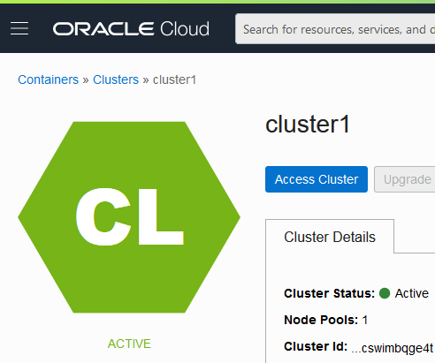
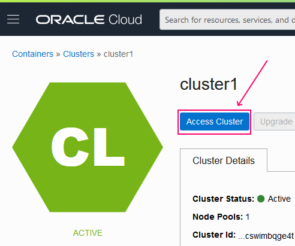
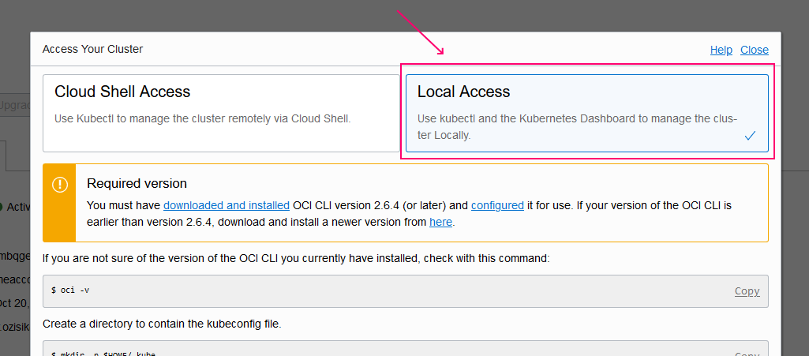
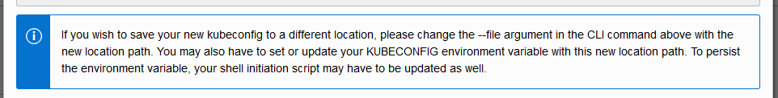
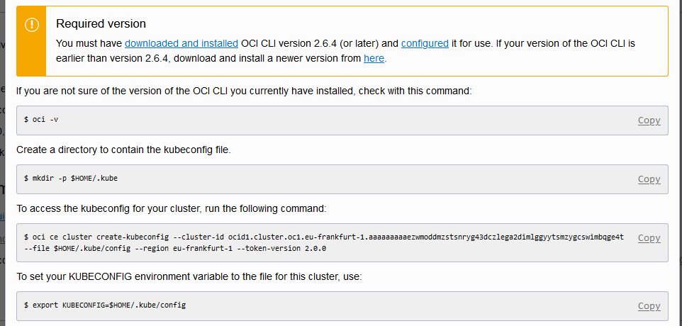
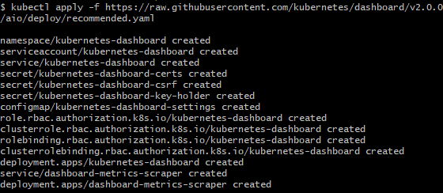
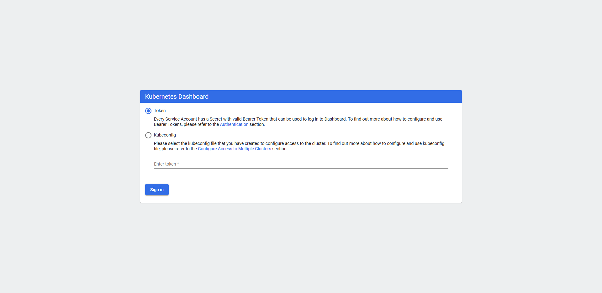
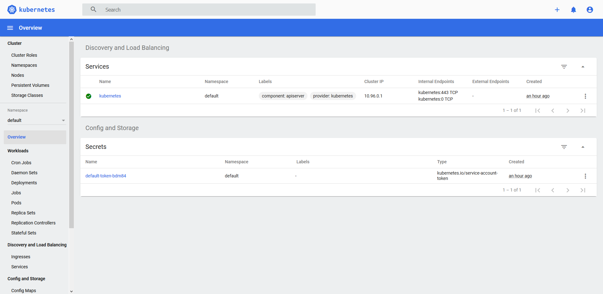

# Steps
1. Prerequisites
2. Access Cluster
3. Install Kubernetes Dashboard
4. Generate Token
5. Access Kubernetes Dashboard


# Prerequisites
## OCI CLI
[OCI CLI](https://docs.cloud.oracle.com/en-us/iaas/Content/API/Concepts/cliconcepts.htm) is a core component to interact with OCI resources. It will be used along authetnicating to the OKE cluster  
If you have it installed, you skip this part. If not please refer to
[OCI CLI install](https://docs.cloud.oracle.com/en-us/iaas/Content/API/SDKDocs/cliinstall.htm)

## Kubectl
[kubectl](https://kubernetes.io/docs/reference/kubectl/overview/) is the CLI tool and main client tool for developers on kubernetes.  
f you have it installed, you skip this part. If not please refer to
[kubectl install](https://kubernetes.io/docs/tasks/tools/install-kubectl/)

# Access Cluster
- You have created a cluster. If you have just created it, it will take some time to be up and running. During this state, the icons will appear in orange and buttons are disabled. Wait a little, grab your coffee, it will be ready soon and orange will turn into green  

 - Press to the Access Cluster button in the details of your cluster page  

  
- Select Local Access  

  
- If you have an existing cluster setup, please refer to the guide stated in blue box. If not, skip this info 


- Follow the steps as stated here. Each OKE cluster will have differnt OCID, copy-pasting from another cluster will not work as intended  


- If you are working with single kube config file, you can put that line within `~/.bashrc` file
```sh
export KUBECONFIG=$HOME/.kube/config
```

Now you have config file

# Install Kubernetes Dashboard
Kubernetes dashboard is no longer shipped within kubernetes by default. In order to access it, this needs to be installed manually

The following commands are taken from [Kubernetes documentation](https://raw.githubusercontent.com/kubernetes/dashboard/v2.0.0/aio/deploy/recommended.yaml
). Use them if this becomes outdated

```sh
kubectl apply -f https://raw.githubusercontent.com/kubernetes/dashboard/v2.0.0/aio/deploy/recommended.yaml
```


# Generate Token
Kubernetes installation on OCI, uses token based authentication. In order to generate the token, OKE Service Admin should be installed on the cluster. Details are explained in the [documentation](https://docs.cloud.oracle.com/en-us/iaas/Content/ContEng/Tasks/contengstartingk8sdashboard.htm), use them if this becomes outdated.

This will deploy service admin on your OKE cluster
```sh
kubectl apply -f https://raw.githubusercontent.com/alperozisik/oke-dashboard/main/oke-admin-service-account.yaml
 ```

It will result in:
```

serviceaccount "oke-admin" created
clusterrolebinding.rbac.authorization.k8s.io "oke-admin" created
```

Once it is ready, run the following to obtain your token
```sh
kubectl -n kube-system describe secret $(kubectl -n kube-system get secret | grep oke-admin | awk '{print $1}')
```
It will print like:
```
Name:         oke-admin-token-gwbp2
Namespace:    kube-system
Labels:       <none>
Annotations:  kubernetes.io/service-account.name: oke-admin
kubernetes.io/service-account.uid: 3a7fcd8e-e123-11e9-81ca-0a580aed8570
Type:  kubernetes.io/service-account-token
Data
====
ca.crt:     1289 bytes
namespace:  11 bytes
token:      eyJh______px1Q
```
In the example above, `eyJh______px1Q` (abbreviated for readability) is the authentication token.  
Copy the value of the `token:` element from the output. You will use this token to connect to the dashboard.  
You may store this in a file (in a safe place) to reuse it when logged out from the dashboard

# Access Kubernetes Dashboard
This command will run a process which enables you to access Kubernetes dashboard from your computer
```sh
kubectl proxy
```
It will prompt:
```
kubectl proxy
Starting to serve on 127.0.0.1:8001
```
- When you are done with dashboard, press `Ctrl + C` to kill that proxy app
- Closing that app, or closing that terminal will result in killing the app

Open your browser and navigate to the following URL:
```
http://localhost:8001/api/v1/namespaces/kubernetes-dashboard/services/https:kubernetes-dashboard:/proxy/#/login
```


1. Token is selected by default
2. Paste the token value that is previously obtained
3. Press sign in

Now you can access Kubernetes Dashboard running on OCI
